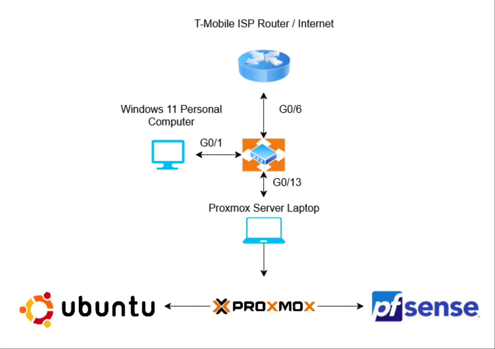

# Configuring Proxmox Networking for My Homelab

Setting up Proxmox on my laptop was step one for building my mini enterprise network lab. Here’s how I configured the networking so my VMs can talk to each other and the internet.

## Topology



## Network Bridge Setup

Proxmox uses Linux Bridges (like virtual switches) to connect VMs to the physical network interfaces on my laptop. I created two main bridges:

- vmbr0 – Connected to my laptop’s physical Ethernet (enx607d094beec2) and handles WAN/internet traffic.
  - IP: None assigned on the Proxmox host; it just passes traffic.
  - Connected to home router: 192.168.12.0/24

- vmbr1 – Internal LAN bridge for VMs to communicate privately.
  - IP Address on Proxmox host: 192.168.12.130/24
  - Gateway: 192.168.12.1 (my router)

## Why Two Bridges?

- vmbr0 connects VMs to the internet through my home router.
- vmbr1 is for internal lab traffic, isolated from the outside network but still routable.

## Key Config Snippet (/etc/network/interfaces)

```ini
auto lo
iface lo inet loopback

auto enx607d094beec2
iface enx607d094beec2 inet manual

auto vmbr0
iface vmbr0 inet manual
    bridge-ports enx607d094beec2
    bridge-stp off
    bridge-fd 0

auto vmbr1
iface vmbr1 inet static
    address 192.168.12.130/24
    gateway 192.168.12.1
    bridge-ports none
    bridge-stp off
    bridge-fd 0
```
